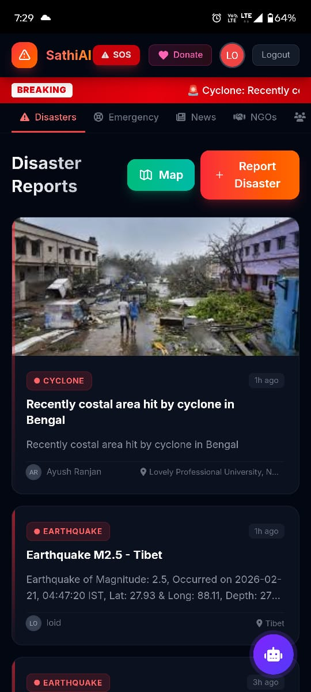
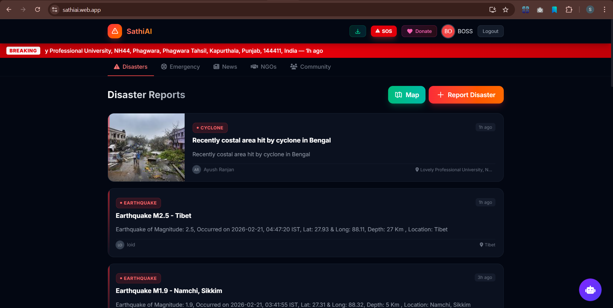

<p align="center">
  
  
  
</p>

# 🚨 SathiAI — AI-Powered Disaster Resilience Platform

> Real-time crowd-sourced disaster reporting, emergency SOS alerts, AI-powered news verification, Razorpay donations, and NGO coordination — all in one platform.

🔗 **Live:** [https://sathiai.web.app](https://sathiai.web.app)

---

<p align="center">
  
  
  <br>
  <em>Left: Android App (Java/FCM) | Right: Web Dashboard (Vite/Tailwind v4)</em>
</p>
## ✨ Features

### 🆘 One-Tap SOS Emergency Button
- **Single tap** instantly sends an emergency alert
- Auto-captures GPS location and reverse-geocodes to readable address
- Auto-fills user's name and generates emergency message: *"HELP! I am in an emergency! My name is [Name]. Location: [Address]"*
- Appears in the live emergency feed within seconds
- Pulsing red button always visible in the header for instant access

### 🗺️ Interactive Google Maps Dashboard
- Real-time map visualization of all disasters, emergencies, and earthquakes
- Auto-fetches **NDMA (National Disaster Management Authority)** earthquake data via CAP feed
- Color-coded markers by disaster type (earthquake 🟤, flood 🔵, fire 🔴, cyclone 🟣, landslide 🟠, etc.)
- Click any marker for full details via info windows
- Tab-aware display — switch between disasters/emergencies and NDMA earthquakes
- Auto-saves new NDMA earthquakes to Firestore with duplicate detection

### 📢 Crowd-Sourced Disaster Reporting
- Report disasters with title, description, type selection, and image upload
- Cloudinary CDN integration for fast, reliable image hosting
- Auto-detect GPS location with reverse geocoding
- Real-time Firestore-powered live feed with infinite scroll
- Breaking news banner for latest critical reports
- Timestamp tracking with relative time display ("2 min ago")

### � Emergency Reporting
- Dedicated emergency submission form separate from disasters
- Two location modes: **Auto-detect GPS** or **Manual address search** (forward geocoding)
- Image upload support with preview
- Type categorization (medical, fire, flood, accident, etc.)
- Live emergency feed with real-time updates

### 🤖 AI-Powered Resilience Chatbot
- **Google Grok AI** powered conversational assistant
- Provides real-time disaster safety guidance and emergency procedures
- Answers questions about first aid, evacuation, and survival tips
- Floating chat bubble with slide-in animation
- Chat history within session
- Typing indicator with animated dots

### 📰 AI News Verification (Fake News Detection)
- Submit news articles/headlines for **Grok AI** authenticity analysis
- Returns confidence score and detailed reasoning
- Detects misinformation, sensationalism, and unverified claims
- Verified news gets published to the community news feed
- Real-time AI processing status indicator

### 💰 Razorpay Donation System
- Integrated **Razorpay payment gateway** for disaster relief donations
- Preset donation amounts (₹100, ₹500, ₹1000) or custom amount
- Secure payment processing with Razorpay checkout modal
- **Auto-generated digital receipt** on successful payment
- Receipt includes: Payment ID, amount, date, donor name, email
- **Download receipt as PNG** — canvas-rendered receipt image with SathiAI branding, payment details, QR-style layout, and "Payment Successful ✅" badge
- Receipt modal with full payment summary

### 🔔 Firebase Cloud Messaging (FCM) Push Notifications
- Real-time push notifications via **Firebase Cloud Messaging**
- Topic-based messaging — all users subscribe to `all_users` topic
- **Auto-notifications**: Backend Firestore listeners detect new disasters/emergencies and auto-send push alerts
- **Manual broadcast**: Admin notification dashboard for custom alerts
- Notification types: disaster (🔴), emergency (🔵), general (🟣) with color-coded display
- High-priority notifications with vibration and sound
- Android notification channel: `sathiai_alerts`

### 🏢 NGO Directory & Registration
- NGOs can register with name, description, contact, website, services, and image
- **Admin approval workflow** — NGOs appear only after admin verification
- Verified NGO listing with cards showing details and contact info
- Image upload via Cloudinary
- Real-time Firestore-powered NGO feed

### � Authentication System
- **Email/password** authentication via Firebase Auth
- Sign-up with display name
- Login/Logout with session persistence
- User avatar and name displayed in header
- Protected actions (report, SOS, donate) require login

### 📱 Progressive Web App (PWA)
- **Installable** — "Add to Home Screen" prompt with install button in header
- **Service Worker** with offline caching strategy
- **Web App Manifest** with app name, icons (192x192, 512x512), theme color
- Standalone display mode — opens like a native app
- Works on mobile and desktop browsers

### 📱 Native Android APK
- Android app wrapping the PWA via **WebView**
- Full **FCM push notification** support with `MyFirebaseMessagingService`
- Notification permission request on launch (Android 13+ / TIRAMISU)
- Geolocation permission handling
- Camera and file upload access
- Custom progress bar during page loads
- Back button navigation within WebView
- External links open in device browser
- Status bar theming
- `compileSdk` and `targetSdk` set to **36**

### 🛡️ Admin Panel
- Password-protected admin dashboard (`/admin.html`)
- Approve/reject NGO registrations
- View all pending and approved NGOs
- Separate notification admin panel (`server/public/admin.html`) for FCM broadcasts

### 📡 NDMA Earthquake Data Integration
- Auto-fetches earthquakes from **NDMA CAP (Common Alerting Protocol)** feed
- Parses XML earthquake data with magnitude, location, depth, and time
- Filters earthquakes by magnitude threshold
- Auto-saves to Firestore with duplicate checking
- Displays on map with earthquake-specific markers

### 🎨 UI/UX
- **Dark theme** with glassmorphism design
- Gradient accents (red/orange for disasters, blue for emergencies, violet for chatbot)
- Smooth animations: fade-in tabs, slide-up toasts, pulse effects, shimmer loading
- Responsive design — works on mobile (380px+), tablet, and desktop
- Custom scrollbar styling
- Tab-based navigation (Disasters, Emergencies, NGOs, News, Earthquakes)
- Toast notification system for user feedback

---

## 🛠️ Tech Stack

| Layer | Technology |
|-------|-----------|
| **Frontend** | HTML5, JavaScript (ES Modules), Tailwind CSS v4, Vite 6 |
| **Backend** | Firebase (Firestore, Auth, Hosting), Node.js + Express |
| **AI** |  AI (news verification + chatbot) |
| **Maps** | Google Maps JavaScript API |
| **Payments** | Razorpay Payment Gateway |
| **Notifications** | Firebase Cloud Messaging (FCM) |
| **Images** | Cloudinary CDN |
| **Geocoding** | Nominatim / OpenStreetMap (reverse + forward) |
| **Mobile** | Android (Java, WebView, Firebase Messaging SDK) |
| **PWA** | Service Worker, Web App Manifest |
| **Data Source** | NDMA CAP Feed (Government earthquake data) |

---

## 📁 Project Structure

```
sathiai/
├── index.html                 # Main app (map, feeds, forms, modals)
├── admin.html                 # Admin panel (NGO approval)
├── vite.config.js             # Vite + Tailwind v4 + NDMA proxy
├── package.json               # Dependencies
├── firebase.json              # Firebase hosting config
├── firestore.rules            # Firestore security rules
├── .env.example               # Environment variables template
│
├── src/
│   ├── main.js                # App orchestration (1400+ lines)
│   ├── style.css              # Tailwind imports + custom animations
│   ├── firebase-init.js       # Firebase SDK initialization
│   ├── auth.js                # Email/password auth
│   ├── disaster.js            # Disaster CRUD + NDMA fetch
│   ├── emergency.js           # Emergency CRUD + geocoding
│   ├── ngo.js                 # NGO registration & listing
│   ├── news.js                # AI news verification
│   ├── chatbot.js             #  AI chatbot
│   └── admin.js               # Admin panel logic
│
├── public/
│   ├── manifest.json          # PWA manifest
│   ├── sw.js                  # Service worker (offline caching)
│   ├── icon-192.svg           # App icon 192x192
│   └── icon-512.svg           # App icon 512x512
│
├── server/                    # Notification server
│   ├── server.js              # Express + Firebase Admin + FCM
│   ├── package.json           # Server dependencies
│   └── public/
│       └── admin.html         # FCM notification dashboard
│
└── APK/                       # Android project
    ├── build.gradle.kts
    ├── gradle/libs.versions.toml
    └── app/
        ├── build.gradle.kts
        └── src/main/
            ├── AndroidManifest.xml
            ├── java/com/mobo/sathiai/
            │   ├── MainActivity.java
            │   └── MyFirebaseMessagingService.java
            └── res/
                ├── layout/activity_main.xml
                ├── drawable/progress_bar.xml
                └── values/colors.xml
```

---

## 🚀 How to Run

### Prerequisites
- **Node.js 18+**
- **Firebase CLI** → `npm install -g firebase-tools`
- A Firebase project with **Firestore**, **Auth**, and **FCM** enabled
- **Google Maps API key**
- **Cloudinary** account (cloud name + upload preset)
- **Razorpay** account (key ID)
- **GROK AI** API key

### 1. Clone & Install

```bash
git clone https://github.com/YOUR_USERNAME/sathiai.git
cd sathiai
npm install
```

### 2. Configure Environment

Copy `.env.example` to `.env` and fill in your keys:

```env
VITE_FIREBASE_API_KEY=your_firebase_api_key
VITE_FIREBASE_AUTH_DOMAIN=your_project.firebaseapp.com
VITE_FIREBASE_PROJECT_ID=your_project_id
VITE_FIREBASE_STORAGE_BUCKET=your_project.appspot.com
VITE_FIREBASE_MESSAGING_SENDER_ID=your_sender_id
VITE_FIREBASE_APP_ID=your_app_id
VITE_GOOGLE_MAPS_KEY=your_google_maps_key
VITE_CLOUDINARY_CLOUD_NAME=your_cloud_name
VITE_CLOUDINARY_UPLOAD_PRESET=your_preset
VITE_GROK_API_KEY=your_grok_api_key
VITE_RAZORPAY_KEY_ID=your_razorpay_key_id
VITE_ADMIN_PASSWORD=your_admin_password
```

### 3. Run Development Server

```bash
npm run dev
```

Open [http://localhost:5173](http://localhost:5173)

### 4. Build for Production

```bash
npm run build
```

### 5. Deploy to Firebase Hosting

```bash
firebase login
firebase deploy --only hosting
```

### 6. Run Notification Server (Optional)

```bash
cd server
npm install
# Place your Firebase service account JSON key in the server directory
node server.js
```

Notification admin dashboard → [http://localhost:3000](http://localhost:3000)

### 7. Build Android APK (Optional)

1. Open `APK/` folder in **Android Studio**
2. Add your `google-services.json` to `APK/app/`
3. Sync Gradle and build
4. Run on device or emulator

---

## � Security

- Firebase Authentication for user identity
- Firestore security rules for read/write access control
- Admin panel protected with password
- Razorpay handles payment security (PCI DSS compliant)
- Service account keys excluded from repository via `.gitignore`
- Environment variables for all sensitive API keys

---

## 🌐 API Integrations

| API | Purpose |
|-----|---------|
| Firebase Firestore | Real-time database for all data |
| Firebase Auth | User authentication |
| Firebase Hosting | Web app deployment |
| Firebase Cloud Messaging | Push notifications |
| Google Maps JS API | Interactive map and markers |
| Grok AI | News verification + chatbot |
| Razorpay Checkout | Payment processing |
| Cloudinary Upload | Image hosting CDN |
| Nominatim | Reverse/forward geocoding |
| NDMA CAP Feed | Government earthquake data |

---

## 📄 License

This project is open source and available under the [MIT License](LICENSE).

---

<p align="center">
  Built with ❤️ for disaster resilience — because timely information saves lives.
</p>

